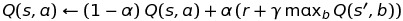
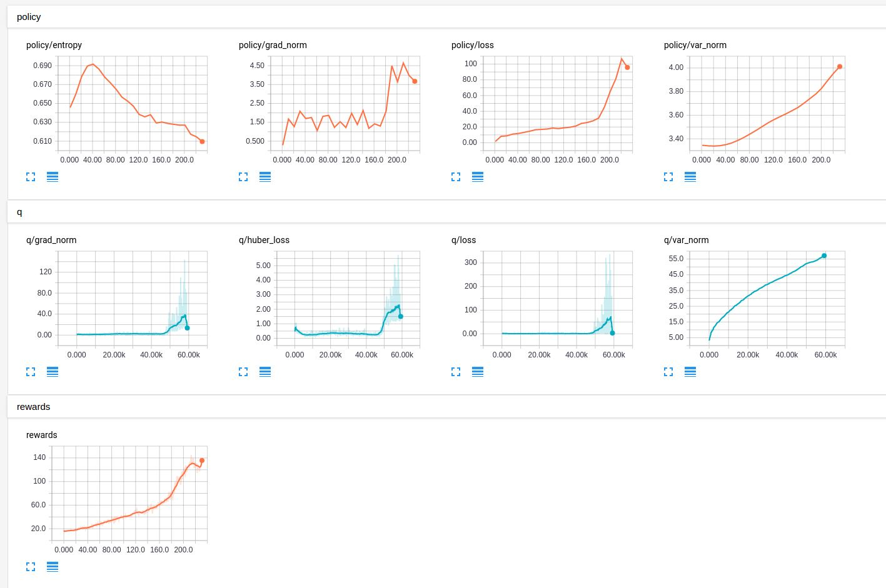

# Temporal Difference Based Actor Critic
Implementation of actor-critic algorithm.

# Dependencies
* Python 2.7 or 3.5
* [TensorFlow](https://www.tensorflow.org/) 1.10
* [gym](https://pypi.python.org/pypi/gym)
* [numpy](https://pypi.python.org/pypi/numpy)
* [tqdm](https://pypi.python.org/pypi/tqdm) progress-bar

# Features
- Using a neural network based policy as the actor
- Using a Q-network as the critic
- Using Policy Gradient Theorem to update critic
- Using a variation of a Q-learning updates to update Q-network
- 

>>> Note that the above equation is similar as in the Q-learning update except that instead of using the max action-values, we are using the averaged action-values. The rationale for using the above update is that this update converges to the action-values of the present policy while the max update (Q-learning update) converges to the action-values of the optimal policy. We need the action-values of the present policies for policy gradient updates that is why we used the above updates.

# Usage

To train a model for Cartpole-v0:

	$ bash run.sh

To view the tensorboard

	$tensorboard --logdir .

# Results

- Tensorboard Progress Bar

